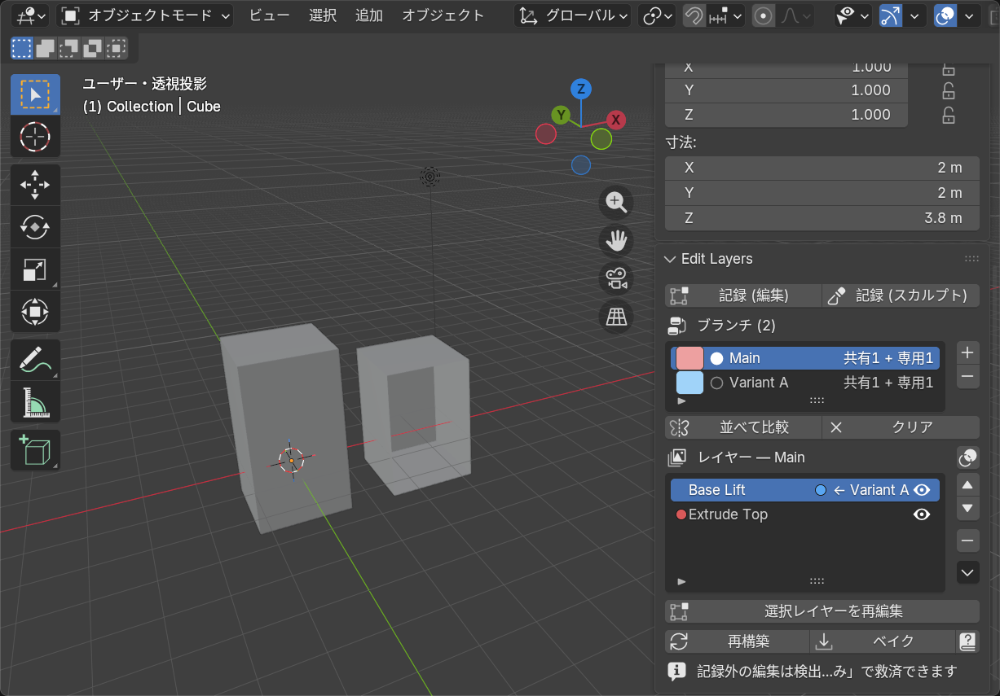
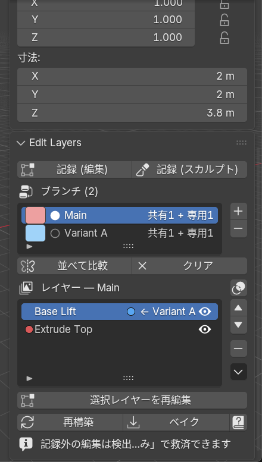
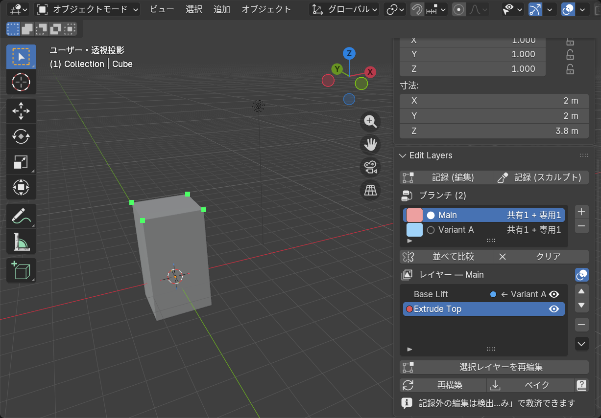
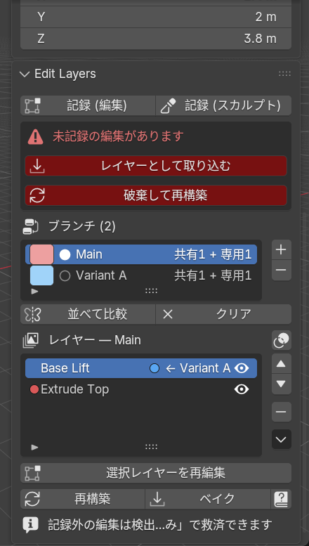

# Edit Layers

[English](README.md) | **日本語**

モデリングの手作業を「レイヤー」として積み上げられる、**非破壊メッシュ編集スタック**を Blender に追加するアドオンです。押し出し・ベベル・サブディバイド・削除などのトポロジ変更を含む編集をレイヤーとして記録し、後から個別に無効化・並べ替え・再編集できます。さらに任意のレイヤーから**ブランチ**を分岐させ、編集パターンの切り替え・比較ができます。

- **場所**: 3D ビューポート > サイドバー (N キー) > Edit Layers タブ
- **対応**: Blender 5.0 以降 / UI は Blender の言語設定に従い日本語・英語が自動で切り替わります
- **ヘルプ**: 画像付きヘルプは [docs/index.html](docs/index.html) (このリポジトリ内)。パネル右下の **?** ボタンからこのページが開きます

## インストール

[Releases](../../releases) から `edit_layers-<version>.zip` をダウンロードし、
プリファレンス > 拡張機能 > 右上メニュー > **Install from Disk** でインストール (Blender 5.0+)。

## 基本ワークフロー

1. メッシュオブジェクトを選択し、パネルの **スタックを初期化** を押す
2. **記録 (編集)** または **記録 (スカルプト)** で記録を開始する
3. 普段どおりに編集する — 専用ツールは不要で、Blender 標準の編集・スカルプト機能がすべて使えます。記録中はモードを自由に行き来してかまいません
4. **コミット** で編集内容が 1 レイヤーとして保存される
5. 完成したら **ベイク** で結果を確定してスタックを削除する

### レイヤーリストの見かた

並び順は上が最初のレイヤー、下が最新 (モディファイアスタックと同じく上から順に適用)。

- **行頭の色ドット** — そのブランチ専用のレイヤー (ブランチの識別色)。空白なら複数ブランチで共有される幹のレイヤー
- **← ブランチ名 バッジ** — そのレイヤーを分岐点として別ブランチが分かれている
- **目アイコン** — レイヤーの有効/無効を切り替え (即座に再構築される)
- **▲▼** で並べ替え、**−** で削除、**選択レイヤーを再編集** で途中のレイヤーに戻って編集できます

### 何が記録されるか

- 頂点の移動、トポロジの追加・削除 (押し出し・ベベル・サブディバイド・ナイフ等なんでも)
- マテリアル割り当て・スムーズ/フラット・シーム・シャープ・クリース・ベベルウェイト
- 押し出し等で生まれた**新規ジオメトリは近傍アンカー相対**で保存されるため、上流レイヤーで形を動かすと押し出し部分も付いてきます
- 記録されないもの: UV・頂点カラー (下記の制限を参照)

## 影響ハイライト

レイヤーリストのヘッダー右にある**オーバーレイアイコン**を有効にすると、選択中のレイヤーが影響した頂点がビューポートに表示されます: **橙 = 移動した頂点 / 緑 = 生成された頂点**。どのレイヤーが何をしたか思い出せないときや、統合・削除の前の確認に便利です。

## レイヤーの整理 — 統合と部分ベイク

レイヤーリスト横の **▼ メニュー** にスタックを整理する操作があります:

- **直前のレイヤーと統合** — 選択レイヤーを 1 つ上 (直前) のレイヤーに統合して 1 枚にします
- **ここまでをベースに確定** — 選択レイヤーまでの内容をベースメッシュに焼き込み、そのレイヤーごと取り除きます (部分ベイク)

どちらも安全ガード付き: 共有レイヤーの統合、他ブランチが失われる部分ベイク、無効レイヤーを含む操作はブロックされます。

## ブランチ — 編集パターンの分岐と比較

1. 分岐させたいレイヤーを選択し、ブランチリスト横の **[+]** を押す
2. 新ブランチがアクティブになり、以降のコミットは新ブランチにだけ積まれる
3. ブランチリストのクリックで即座に切り替え。**並べて比較** で他ブランチの結果を複製として横に並べ、**クリア** で片付けられます

- 分岐点より上流の共有レイヤーを再編集すると**全ブランチに波及**します (実体を共有しているため)
- 共有レイヤーの削除や、共有レイヤーをまたぐ並べ替えは安全のためブロックされます
- ブランチ削除時は、そのブランチ**専用**のレイヤーだけが一緒に削除されます
- 気に入った比較結果は複製してキープできます (自分で複製したものは「クリア」で消えません)
- ブランチの識別色はブランチリストの色チップをクリックして変更できます

## 記録し忘れの救済

記録を開始せずに編集してしまっても、未記録の編集は自動検出されます。**レイヤーとして取り込む** を押せば、遡って通常のレイヤーと同じ品質で保存されます。未記録編集がある間は、それを消してしまう操作 (記録開始・並べ替え・ベイク等) はブロックされ、**破棄して再構築** を押したときだけ捨てられます。

## シェイプキーについて (排他)

シェイプキーは頂点インデックスに直接依存するため、本アドオンと**併用できません**:

- キーのあるメッシュではスタックを初期化できません (先にキーを適用/削除)
- スタック運用中にキーを追加すると**即座に自動で取り消され**、通知が表示されます
- **スタックを破棄 (現状を確定)** を使えば、現在のメッシュを保持したままスタックだけを外して通常のワークフローに戻れます

推奨: モデリング (Edit Layers) を終えてベイクした後にシェイプキーを作成してください。

## 制限事項

- 新規頂点のアンカー追従は平行移動のみです (上流の回転・スケールにはオフセットが回転しません)
- UV と頂点カラーは記録されません
- スカルプトの Dyntopo / リメッシュはトポロジが全面的に変わるため、非常に大きなレイヤーになります (壊れはしません)
- マルチレゾモディファイアの変位は記録されません
- 記録中に Blender を終了すると、その記録セッションは失われます (コミット済みレイヤーは .blend に保存されます)

## データの保存場所

| データ | 場所 |
|---|---|
| レイヤースタック | `Object.edit_layers` (.blend に保存) |
| ベースメッシュ | `<メッシュ名>_el_base` (fake user 付き Mesh) |
| 永続頂点 ID | メッシュの `el_id` INT 属性 (POINT ドメイン) |

困ったときは **再構築** ボタンでスタックを再適用できます。参照が壊れた場合はパネル下部に警告が表示され、該当部分だけがスキップされます (クラッシュはしません)。

## 開発

ビルド・テスト・Blender Extensions への申請手順は [DEVELOPMENT.md](DEVELOPMENT.md) を参照。

## ライセンス

GPL-3.0-or-later
